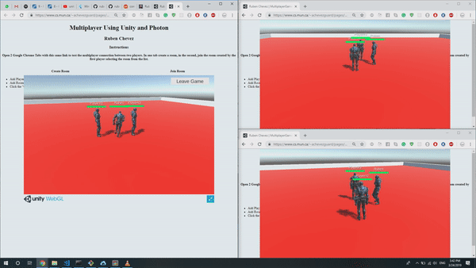
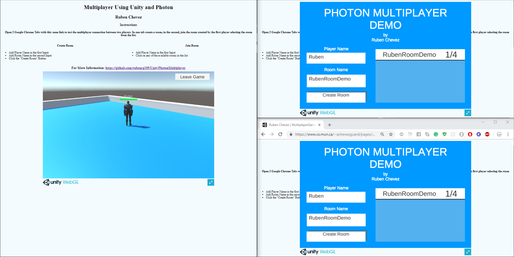
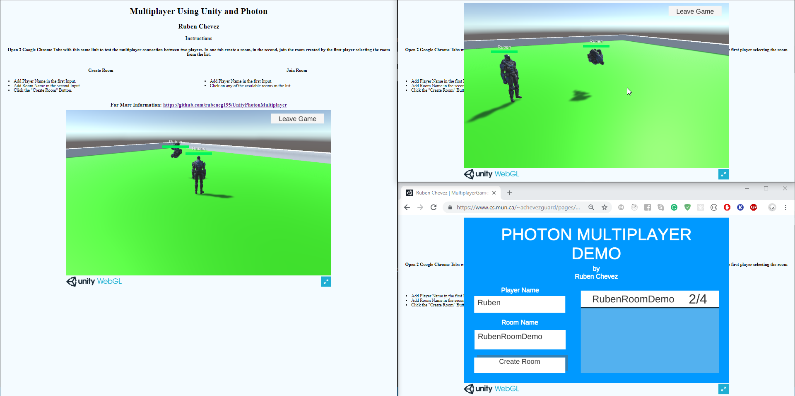
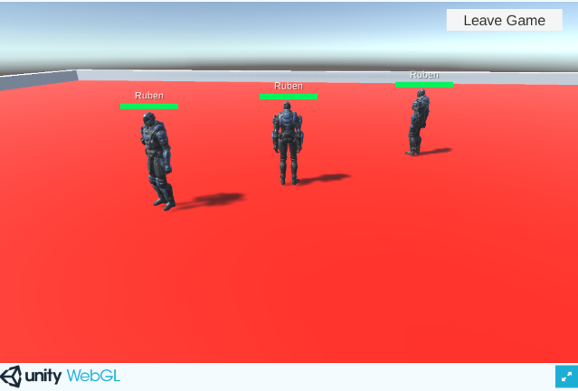

# Unity Photon Multiplayer

Based on the following docs:

https://doc.photonengine.com/en-us/pun/v2/demos-and-tutorials/pun-basics-tutorial/intro

# Versions
1. Photon PUN 2 v2.8.1 (21. March 2019)
2. Unity 2018.3.9f1

**Instructions**

Open 2 Google Chrome Tabs with this same link to test the multiplayer connection between two players. In one tab create a room, in the second, join the room created by the first player selecting the room from the list.

**Create Room**

1. Add Player Name in the first Input.
2. Add Room Name in the second Input.
3. Click the "Create Room" Button.

**Join Room**

1. Add Player Name in the first Input.
2. Click on any of the available rooms in the list.
3. For More Information: https://github.com/rubencg195/UnityPhotonMultiplayer

**Note: It only works on Desktop Browsers (Google Chrome, Firefox).**

# Demo

To Play the Demo, click on the following link:
https://rubencg195.github.io/pages/multiplayer/

# Video
https://youtu.be/7uf-Xpg-_2E

# Captures

**1. Player #1 Create a Room**

**2. Player #2 Joins the Room From the List**

**3. Player #3 Joins the Room From the List**

